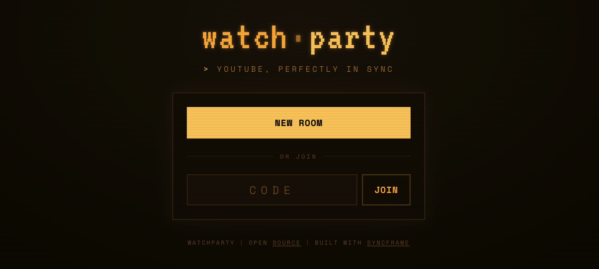

# watchparty

**Watch YouTube together, perfectly in sync, with just a browser.**

A YouTube watch-party for browsers. Share a 4-character room code, paste a YouTube link, and everyone watches in lockstep — play, pause, and scrub stay synced across every viewer, on any device.

**Live at [watchparty.jkvc.ai](https://watchparty.jkvc.ai/).**



Built on [Next.js](https://nextjs.org), the [`@syncframe`](https://www.npmjs.com/package/@syncframe/core) anchor-based dead-reckoning sync protocol, and Redis.

## How it works

- **Rooms** are identified by a 4-character code (`A–Z`, `0–9`). Anyone with the code can join and control playback. There is no room list — the entrance either creates a room or joins one by code.
- **Playback** is represented as a single *scalar anchor*: "at server time `t`, the video was at `p` seconds, advancing at rate `r`." Every browser evaluates that anchor against an NTP-style synced server clock, so they all land on the same frame without chattering position updates back and forth.
- **Controls** are YouTube's own native player controls — play, pause, and scrub. Whatever any viewer does is captured and broadcast; everyone else follows.
- **Presence** shows a live viewer count via heartbeats stored in Redis.
- **Self-healing sync** — there is no room-wide barrier. A viewer who stalls (an ad, buffering, a slow load) simply falls behind and snaps back to the live position when they recover, so one person's ad never freezes everyone else. Followers correct drift with an adaptive tolerance that widens under repeated correction (no seek-storms) and a learned seek-latency offset (corrections land on the live frame).
- **TTL** — rooms expire after **1 week** of inactivity. Any activity (a control, a heartbeat) slides the expiry forward.

See [`notes/`](notes/) for the full design rationale and the YouTube-embedding caveats (ads, login/Premium, un-embeddable videos).

## Getting started

Requires Node ≥ 20, [pnpm](https://pnpm.io), and a Redis instance.

```bash
pnpm install

# Provide a Redis URL. With Vercel: `vercel env pull .env.local`.
cp .env.example .env.local   # then edit REDIS_URL

pnpm dev                     # http://localhost:3000
```

### Shared Redis

`REDIS_URL` may point at a Redis instance shared with other apps. Every key this app writes is namespaced under the **`wp:`** prefix, so it coexists safely with other namespaces. Do not add un-prefixed keys.

## Scripts

| Command | Description |
| --- | --- |
| `pnpm dev` | Dev server (Turbopack) on `localhost:3000` |
| `pnpm build` | Production build |
| `pnpm build:check` | Isolated build into `.next-check` (won't disturb a running dev server) |
| `pnpm type-check` | `tsc --noEmit` |
| `pnpm lint` | ESLint |
| `pnpm test` | Unit tests (vitest) |

A pre-push hook runs type-check, lint, and tests in parallel, then an isolated build.

## Environment

| Variable | Required | Description |
| --- | --- | --- |
| `REDIS_URL` | yes | ioredis connection string for room state, pub/sub, presence, and TTL |

## Caveats (YouTube embedding)

YouTube's IFrame Player API has hard limits we cannot engineer around:

- **Ads are invisible to the API** and cannot be skipped or detected reliably. A viewer without Premium may hit an ad and fall behind; they catch up to the live position automatically when the ad ends (no barrier, no effect on other viewers).
- **We cannot control a viewer's login / Premium status** — sync quality depends on each viewer's own YouTube session.
- **Some videos disallow embedding**; those surface an in-room error (with a reload affordance) and cannot be played.

## License

MIT
